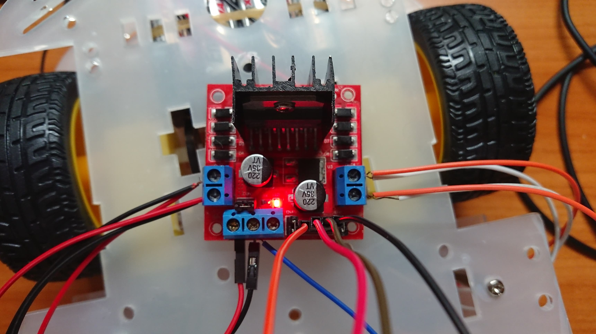
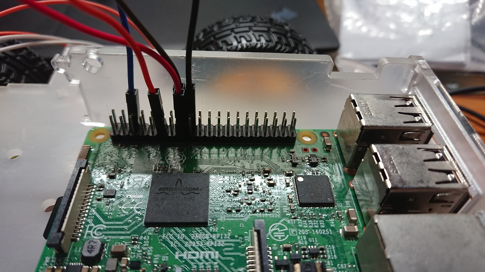

# IoT_Final_Project: Surveillance Car controlled with website
The orginal idea was to design a car that could be controlled without raspberry pi itself. In real life, this can be used when encountered serious traffic; the officer could move the car from their interface, and guide the traffic. For future adaptation, we can train our car and recognize specific gestures so that the traffic police could control the car with its gestures.
# Equipment Required
Raspberry Pi * 1  
Micro SD * 1  
Robot Car Chassis * 1  
L298N Motor Controller * 1  
DC Motors * 4
IP Camera * 1  
Dupont Line * 7  
Copper Line * 8  
# Getting Started
## First
Install all the systems we needed:  
Tutorial for installing operating system on your RPi: https://drive.google.com/open?id=1e_KVF0n1kBArT1zC4e_Q_EsCCeYeyH8h  
Breif knowledge of GPIO: https://drive.google.com/open?id=10NRMrGdvyJOpKrEXrakgWA8GJoHJjmpS
### Step 1
Attach all your equipments altogether:  

  
The five GPIO ports we will be using is:  
PIN6-> BLUE line  
PIN11(BCM17)-> ORANGE line   
PIN15(BCM22)-> RED line  
PIN16(BCM23)-> BROWN line  
PIN17(BCM24)-> BLACK line  
### Step 
You will need to install **'Motion' Library**:  
`sudo apt-get install motion`
### Step 
### Step 
### Step 
### Step 

