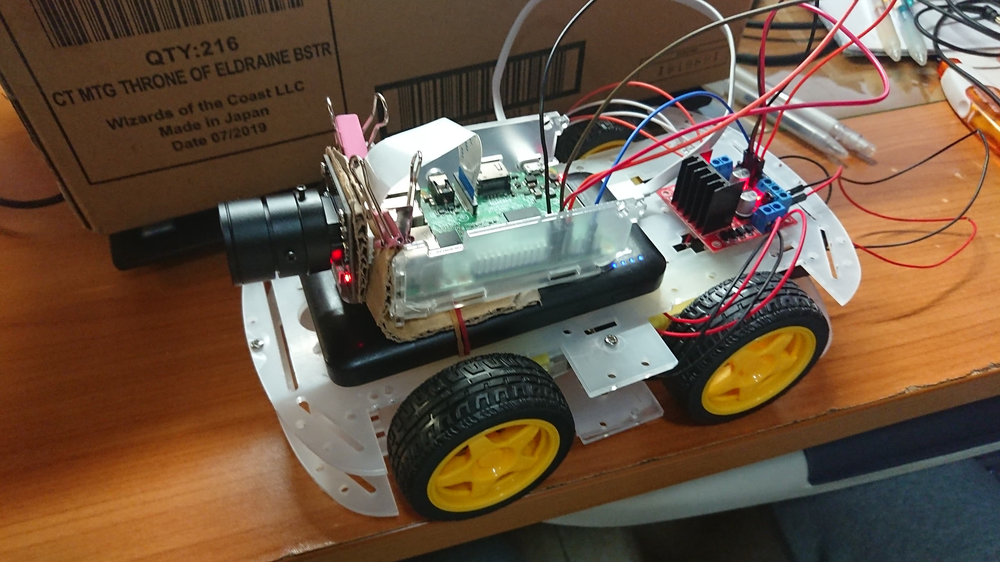
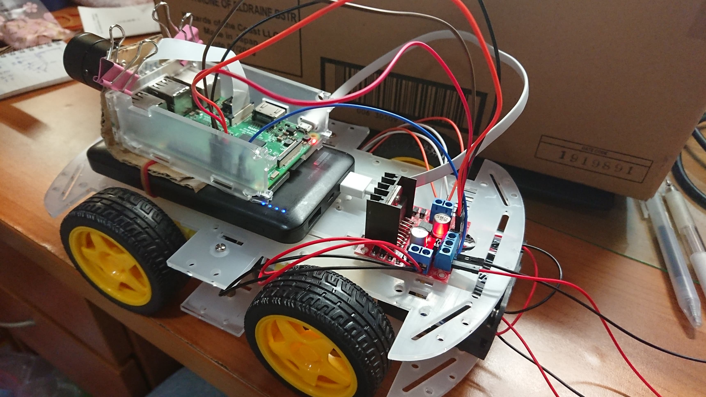
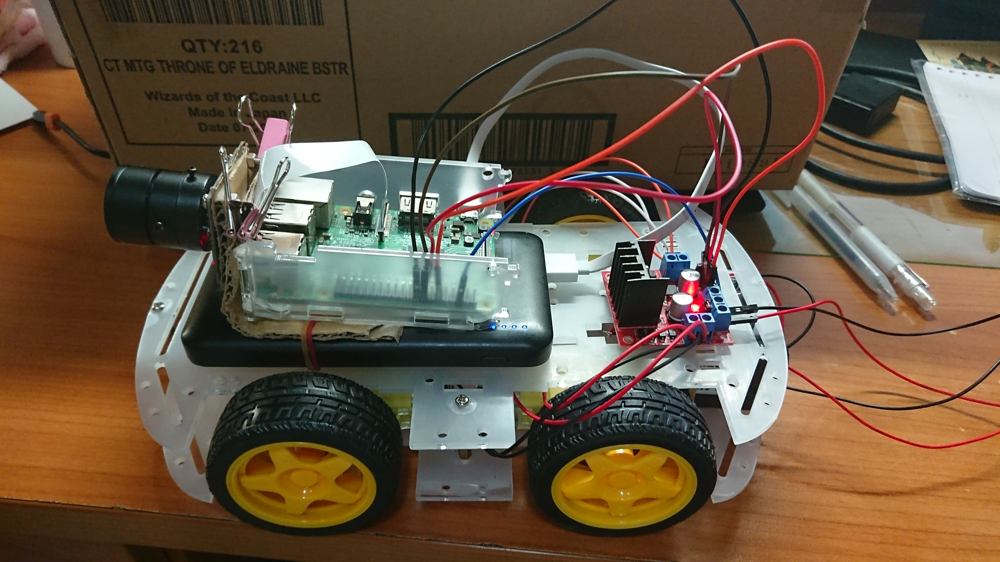

# IoT_Final_Project: Surveillance Car controlled with website
The orginal idea was to design a car that could be controlled without raspberry pi itself. In real life, this can be used when encountered serious traffic; the officer could move the car from their interface, and guide the traffic. For future adaptation, we can train our car and recognize specific gestures so that the traffic police could control the car with its gestures.
# Equipment Required
Raspberry Pi 3 * 1  
Micro SD * 1  
Robot Car Chassis * 1  
L298N Motor Controller * 1  
DC Motors * 4
IP Camera * 1  
4 x 1.5V AA Battery Holder * 2  
Dupont Line * 7  
Copper Line * 8  
# Getting Started
## First
Install all the systems we needed:  
Tutorial for installing operating system on your RPi: https://drive.google.com/open?id=1e_KVF0n1kBArT1zC4e_Q_EsCCeYeyH8h  
Breif knowledge of GPIO: https://drive.google.com/open?id=10NRMrGdvyJOpKrEXrakgWA8GJoHJjmpS
### Step 1
Attach all your equipments altogether:  

  
The five GPIO ports we will be using is:  
PIN6-> BLUE line  
PIN11(BCM17)-> ORANGE line   
PIN15(BCM22)-> RED line  
PIN16(BCM23)-> BROWN line  
PIN17(BCM24)-> BLACK line
### Step2  
On the L298N, we will have to attach the RED and BLACK line as the picture shows  
### Step3  
As to how the motors attach, you can follow this video:  
https://www.youtube.com/watch?v=bNOlimnWZJE  
## SECOND  
### Step 1  
You will need to install **'Motion' Library**:  
`sudo apt-get install motion`
### Step 2  
Change the settings of the IP camera,  by editing the file: /etc/default/motion so that it will be always running. Edit this file using ‘nano’ editor with ‘sudo’ like given below:  
`sudo nano /etc/default/motion`
### Step 3  
Change the setting to the following parameters to have a better result of IP camera:  
1.`daemon on`  
2.`width 640` & `height 480`  
3.`framerate 30`  
4.`threshold 100`  
5.`pre_capture 5` & `post_capture 900` & `event_gap 0`  
6.`stream_maxrate 100`  
7.`stream_localhost off`  
Finally, run`$sudo service motion restart` to start using your IP camera
## THIRD  
### Step 1  
We need FLASK to communicate with our website, install flask support package into the Raspberry Pi:  
`$ pip install Flask`
### Step 2  
Then we can use the Flask by just importing it in our program  
`from flask import Flask`  
`from flask import Flask, render_template, request`  
## FORTH  
### Step 1  
The python code is in `/propose/Run.py` and the website code is in `/propose/templates/robot.html`  
You have to change your port number in `robot.html` where ` <!--Enter the IP Address of your Raspberry Pi-->`
### Step 2  
It is important to put the file this way, so that when we run`Run.py`we can access our IP camera and control our car by entering the website `http://enter your rpi port:5010`  
You can check your port by entering:  
`ifconfig`  
*NOTE: Make sure your RPi and your computer is connected to the same internet*
### Step 3  
And now you are good to go!  
The final project will look like this:  
  
  
  
https://drive.google.com/open?id=1nwYbSwuluK011wdBBOuZflE8mwZRg2ax  
# CODE EXPLANATION
## Run.py
The four GPIO pins we used is **(17,22,23,24)**  
**17**  controls the two right wheels going BACKWARDS  
**22**  controls the two right wheels going FOWARDS  
**23**  controls the two left wheels going FOWARDS  
**24**  controls the two left wheels going BACKWARDS  
**TRUE** gives the motor electricity  
**FALSE** cuts the electricity  
thus, the following code indicates how the car will go FOWARDS:  
```python
def up_side():
   data1="FORWARD"
   gpio.output(17,False)
   gpio.output(22,True)
   gpio.output(23,True)
   gpio.output(24,False)
   return 'true'
```


